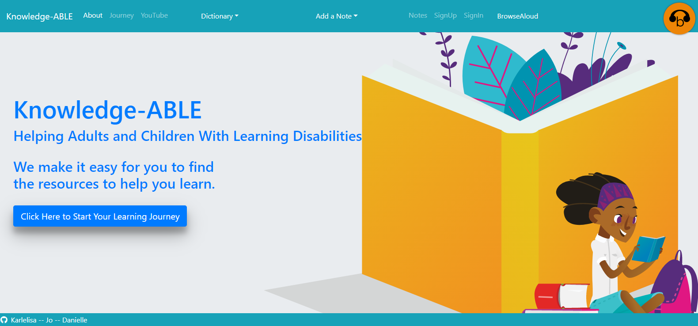

# Knowledge-ABLE React App
## Introduction

Knowledge-ABLE is entitled to benefit those who have learning disabilities to achieve their full potential.
Using this app will help people gain a solid understanding of different types of learning disabilities, find a variety of methods to improve their ability to learn, and obtain resources to physical assistances including tutors.

## Technologies Used
- Client Side: HTML, Bootstrap, CSS, React JS, Modal
- Server Side: JS, JSon, RegEx, Local Storage, Node.js, Express, Axios
- DataBase: MongoDB, Mongoose
- API: YouTube, Browsealoud, Google Custom Search Engine, Words API
- Authentication: JSONWebToken, JWT decode, BCrypt JS, Morgan
- Project Management: Github project & Slack

**Please note: [Browsealoud](https://www.youtube.com/watch?v=w9uxDRpISUI) software was a free trial we used from Feb 23rd to March 27th.

## Check out the app in action
http://knowledge-able.herokuapp.com/

## Amazing Team Members
- Karlelisa - Authentication master, UI designer - https://github.com/Karlelisa
- Danielle - Business Development, Project Management, Utility Player - https://github.com/daniellekeefe
- Jo - Functions builder, Git manager, DB - https://github.com/zhaoyu-qiao

## About Page Screenshot

## Users mongoDB showing authenticated user with hashed password (example user)
> use learningdisabilities
switched to db learningdisabilities
> show collections
books
notes
users
> db.users.find()
{ "_id" : ObjectId("5e65339d730a2a54507be51b"), "notes" : [ ], "username" : "karlelisa", "email" : "karlelisaw@gmail.com", "password" : "$2b$10$Ubz3GrU0NRI4r4ONeWA4v.xEHrMr7vhB4qXmK5Gxmm69djvkfvA7a", "__v" : 0 }
{ "_id" : ObjectId("5e68f65a28c5df5ec21cd4ce"), "notes" : [ ], "username" : "karlie", "email" : "karliew@gmail.com", "password" : "$2b$10$/PFZdzzF2gnLehffXq34UOrJusBlFYXktRqAnhHAYQBFgxR8Mkbtq", "__v" : 0 }

